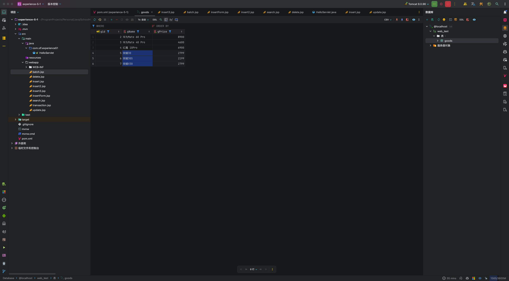

# 第五次实验

## 实验目的

1. JSP 中采用JDBC连接数据库，实现对数据表的增删改查操作。
1. 实验Mysql 数据库建库建表，考虑表之间的关系。
1. 实现注册和登录功能。
1. 教材第7章的所有例题需要调试通过。


## 实验内容

### 实验Mysql 数据库建库建表，考虑表之间的关系

#### 源代码

```mysql
CREATE DATABASE userdb;
USE userdb;

-- 用户表
CREATE TABLE users (
    id INT AUTO_INCREMENT PRIMARY KEY,
    username VARCHAR(50) NOT NULL UNIQUE,
    password VARCHAR(100) NOT NULL,
    email VARCHAR(100) NOT NULL UNIQUE
);

-- 文章表
CREATE TABLE articles (
    id INT AUTO_INCREMENT PRIMARY KEY,
    title VARCHAR(255) NOT NULL,
    content TEXT NOT NULL,
    author_id INT,
    created_at TIMESTAMP DEFAULT CURRENT_TIMESTAMP,
    FOREIGN KEY (author_id) REFERENCES users(id)
);
```


### 实现注册和登录功能

#### 源代码

```java
package com.xlf.experiment5;

import com.xlf.experiment5.utils.DBUtil;
import jakarta.servlet.ServletException;
import jakarta.servlet.annotation.WebServlet;
import jakarta.servlet.http.HttpServlet;
import jakarta.servlet.http.HttpServletRequest;
import jakarta.servlet.http.HttpServletResponse;

import java.io.IOException;
import java.sql.Connection;
import java.sql.PreparedStatement;
import java.sql.ResultSet;

@WebServlet("/loginServlet")
public class LoginServlet extends HttpServlet {
    @Override
    protected void doPost(HttpServletRequest request, HttpServletResponse response) throws ServletException, IOException {
        response.setContentType("text/html;charset=utf-8");
        String username = request.getParameter("username");
        String password = request.getParameter("password");

        Connection conn = null;
        PreparedStatement stmt = null;
        ResultSet rs = null;

        try {
            conn = DBUtil.getConnection();
            String sql = "SELECT * FROM users WHERE username = ? AND password = ?";
            stmt = conn.prepareStatement(sql);
            stmt.setString(1, username);
            stmt.setString(2, password); // 密码应加密后比对
            rs = stmt.executeQuery();

            if (rs.next()) {
                response.getWriter().println("登录成功，欢迎 " + username + "！");
            } else {
                response.getWriter().println("用户名或密码错误！");
            }
        } catch (Exception e) {
            e.printStackTrace();
            response.getWriter().println("错误: " + e.getMessage());
        } finally {
            DBUtil.close(conn, stmt, rs);
        }
    }
}
```

```java
package com.xlf.experiment5;


import com.xlf.experiment5.utils.DBUtil;
import jakarta.servlet.ServletException;
import jakarta.servlet.annotation.WebServlet;
import jakarta.servlet.http.HttpServlet;
import jakarta.servlet.http.HttpServletRequest;
import jakarta.servlet.http.HttpServletResponse;

import java.io.IOException;
import java.sql.Connection;
import java.sql.PreparedStatement;

@WebServlet("/registerServlet")
public class RegisterServlet extends HttpServlet {
    @Override
    protected void doPost(HttpServletRequest request, HttpServletResponse response) throws ServletException, IOException {
        response.setContentType("text/html;charset=utf-8");
        String username = request.getParameter("username");
        String password = request.getParameter("password");
        String email = request.getParameter("email");

        Connection conn = null;
        PreparedStatement stmt = null;

        try {
            conn = DBUtil.getConnection();
            String sql = "INSERT INTO users (username, password, email) VALUES (?, ?, ?)";
            stmt = conn.prepareStatement(sql);
            stmt.setString(1, username);
            stmt.setString(2, password);
            stmt.setString(3, email);
            int rows = stmt.executeUpdate();

            if (rows > 0) {
                response.getWriter().println("注册成功！");
            } else {
                response.getWriter().println("注册失败，请重试！");
            }
        } catch (Exception e) {
            e.printStackTrace();
            response.getWriter().println("错误: " + e.getMessage());
        } finally {
            DBUtil.close(conn, stmt, null);
        }
    }
}
```

```jsp
<%@ page contentType="text/html;charset=UTF-8" language="java" %>
<!DOCTYPE html>
<html>
<head>
    <title>登录</title>
</head>
<body>
<h1>用户登录</h1>
<form action="loginServlet" method="post">
    用户名: <input type="text" name="username" required><br>
    密码: <input type="password" name="password" required><br>
    <button type="submit">登录</button>
</form>
</body>
</html>
```

```jsp
<%@ page contentType="text/html;charset=UTF-8" language="java" %>
<!DOCTYPE html>
<html>
<head>
    <title>注册</title>
</head>
<body>
<h1>用户注册</h1>
<form action="registerServlet" method="post">
    用户名: <input type="text" name="username" required><br>
    密码: <input type="password" name="password" required><br>
    邮箱: <input type="email" name="email" required><br>
    <button type="submit">注册</button>
</form>
</body>
</html>

```


#### 截图


### 教材第七章所有例题测试通过

#### 7-1

##### 源代码

```jsp
<%@ page language="java" contentType="text/html; charset=UTF-8"
         pageEncoding="UTF-8" %>
<%@page import="java.sql.*" %>
<!DOCTYPE html>
<html>
<head>
    <meta http-equiv="Content-Type" content="text/html; charset=UTF-8">
    <title>Insert title here</title>
</head>
<body>
<%
    String jdbc_driver = "com.mysql.jdbc.Driver";
    /*连接本地localhost的服务器，端口号为默认3306，web_test为数据库名称，UTF-8编码进行数据库的连接*/
    String db_url = "jdbc:mysql://localhost:3306/web_test?useUnicode=true&characterEncoding=UTF-8";
    String user = "root";//连接数据库的用户名
    String password = "123456"; //数据库用户对应的密码
    Class.forName(jdbc_driver);
    Connection conn = DriverManager.getConnection(db_url, user, password);
//创建statement接口对象
    Statement stmt = conn.createStatement();
    String sql = "INSERT INTO goods(gName,gPrice)VALUES('红米K30Pro','2699.00')";
    int i = stmt.executeUpdate(sql);
    out.println("成功添加" + i + "行数据");
    stmt.close();
    conn.close();
%>
</body>
</html>
```


##### 截图


#### 7-2

##### 源代码

```jsp
<%@ page language="java" contentType="text/html; charset=UTF-8"
         pageEncoding="UTF-8" %>
<%@page import="java.sql.*" %>
<!DOCTYPE html>
<html>
<head>
    <meta http-equiv="Content-Type" content="text/html; charset=UTF-8">
    <title>Insert title here</title>
</head>
<body>
<% String jdbc_driver = "com.mysql.jdbc.Driver";
    /*连接本地localhost的服务器，端口号为默认3306，web_test为数据库名称，UTF-8编码进行数据库的连接*/
    String db_url = "jdbc:mysql://localhost:3306/web_test?useUnicode=true&characterEncoding=UTF-8";
    String user = "root";//连接数据库的用户名
    String password = "123456"; //数据库用户对应的密码
    Class.forName(jdbc_driver);
    Connection conn = DriverManager.getConnection(db_url, user, password);
    Statement stmt = conn.createStatement();
    String sql = "UPDATE goods SET gPrice='2499.00' where gName='红米K30Pro'";
    int i = stmt.executeUpdate(sql);
    out.println("成功修改" + i + "行数据");
    stmt.close();
    conn.close();
%>
</body>
</html>
```


##### 截图


#### 7-3

##### 源代码

```jsp
<%@ page language="java" contentType="text/html; charset=UTF-8"
         pageEncoding="UTF-8" %>
<%@page import="java.sql.*" %>
<!DOCTYPE html>
<html>
<head>
    <meta http-equiv="Content-Type" content="text/html; charset=UTF-8">
    <title>Insert title here</title>
</head>
<body>
<% String jdbc_driver = "com.mysql.jdbc.Driver";
    /*连接本地localhost的服务器，端口号为默认3306，web_test为数据库名称，UTF-8编码进行数据库的连接*/
    String db_url = "jdbc:mysql://localhost:3306/web_test?useUnicode=true&characterEncoding=UTF-8";
    String user = "root";//连接数据库的用户名
    String password = "123456"; //数据库用户对应的密码
    Class.forName(jdbc_driver);
    Connection conn = DriverManager.getConnection(db_url, user, password);
    Statement stmt = conn.createStatement();
    String sql = "DELETE FROM goods where gName='红米K30Pro'";
    int i = stmt.executeUpdate(sql);
    out.println("成功删除" + i + "行数据");
    stmt.close();
    conn.close();
%>
</body>
</html>
```


##### 截图


#### 7-4

##### 源代码

```jsp
<%@ page language="java" contentType="text/html; charset=UTF-8"
         pageEncoding="UTF-8" %>
<%@page import="java.sql.*" %>
<!DOCTYPE html>
<html>
<head>
    <meta http-equiv="Content-Type" content="text/html; charset=UTF-8">
    <title>Insert title here</title>
</head>
<body>
<% String jdbc_driver = "com.mysql.jdbc.Driver";
    /*连接本地localhost的服务器，端口号为默认3306，web_test为数据库名称，UTF-8编码进行数据库的连接*/
    String db_url = "jdbc:mysql://localhost:3306/web_test?useUnicode=true&characterEncoding=UTF-8";
    String user = "root";//连接数据库的用户名
    String password = "123456"; //数据库用户对应的密码
    Class.forName(jdbc_driver);
    Connection conn = DriverManager.getConnection(db_url, user, password);
    Statement stmt = conn.createStatement();
    String sql = "SELECT gId,gName,gPrice from goods where gName like '华为%'";
    ResultSet rs = stmt.executeQuery(sql);
    while (rs.next()) {
        String gId = rs.getString("gId");
        String gName = rs.getString("gName");
        String gPrice = String.format("%.2f", rs.getDouble("gPrice"));
        out.println(gId + "&nbsp;" + gName + "&nbsp;" + gPrice + "<br>");
    }
    rs.close();
    stmt.close();
    conn.close();
%>
</body>
</html>
```


##### 截图


#### 7-5(6)

##### 源代码

```jsp
<%@ page language="java" contentType="text/html; charset=UTF-8"
         pageEncoding="UTF-8" %>
<!DOCTYPE html>
<html>
<head>
    <meta http-equiv="Content-Type" content="text/html; charset=UTF-8">
    <title>Insert title here</title>
</head>
<body>
<form action="insert3.jsp" method="post">
    输入商品名称:<input type="text" name="gName"><br>
    输入商品价格:<input type="text" name="gPrice"><br>
    <input type="submit" value="提交">
</form>
</body>
</html>
```

```jsp
<%@ page language="java" contentType="text/html; charset=UTF-8"
         pageEncoding="UTF-8" %>
<%@page import="java.sql.*" %>
<!DOCTYPE html>
<html>
<head>
    <meta http-equiv="Content-Type" content="text/html; charset=UTF-8">
    <title>Insert title here</title>
</head>
<body>
<%
    String jdbc_driver = "com.mysql.jdbc.Driver";
    /*连接本地localhost的服务器，端口号为默认3306，web_test为数据库名称，UTF-8编码进行数据库的连接*/
    String db_url = "jdbc:mysql://localhost:3306/web_test?useUnicode=true&characterEncoding=UTF-8";
    String user = "root";//连接数据库的用户名
    String password = "123456"; //数据库用户对应的密码
    Class.forName(jdbc_driver);
    Connection conn = DriverManager.getConnection(db_url, user, password);
//创建statement接口对象
    Statement stmt = conn.createStatement();
    String gName = request.getParameter("gName");
    String gPrice = request.getParameter("gPrice");
    String sql = "INSERT INTO goods(gName,gPrice)VALUES('" + gName + "','" + gPrice + "')";
    int i = stmt.executeUpdate(sql);
    out.println("成功添加" + i + "行数据");
    stmt.close();
    conn.close();
%>
</body>
</html>
```

```jsp
<%@ page language="java" contentType="text/html; charset=UTF-8"
         pageEncoding="UTF-8" %>
<%@page import="java.sql.*" %>
<!DOCTYPE html>
<html>
<head>
    <meta http-equiv="Content-Type" content="text/html; charset=UTF-8">
    <title>Insert title here</title>
</head>
<body>
<%
    String jdbc_driver = "com.mysql.jdbc.Driver";
    /*连接本地localhost的服务器，端口号为默认3306，web_test为数据库名称，UTF-8编码进行数据库的连接*/
    String db_url = "jdbc:mysql://localhost:3306/web_test?useUnicode=true&characterEncoding=UTF-8";
    String user = "root";//连接数据库的用户名
    String password = "123456"; //数据库用户对应的密码
    Class.forName(jdbc_driver);
    Connection conn = DriverManager.getConnection(db_url, user, password);
    String gName = request.getParameter("gName");
    String gPrice = request.getParameter("gPrice");
    String sql = "INSERT INTO goods(gName,gPrice)VALUES(?,?)";
    PreparedStatement psmt = conn.prepareStatement(sql);
    psmt.setString(1, gName);
    psmt.setString(2, gPrice);
    int i = psmt.executeUpdate();
    out.println("成功添加" + i + "行数据");
    psmt.close();
    conn.close();
%>
</body>
</html>
```


##### 截图


#### 7-7

##### 源代码

```jsp
<%@ page language="java" contentType="text/html; charset=UTF-8"
         pageEncoding="UTF-8" %>
<%@page import="java.sql.*" %>
<!DOCTYPE html>
<html>
<head>
    <meta http-equiv="Content-Type" content="text/html; charset=UTF-8">
    <title>Insert title here</title>
</head>
<body>
<%
    String jdbc_driver = "com.mysql.jdbc.Driver";
    /*连接本地localhost的服务器，端口号为默认3306，web_test为数据库名称，UTF-8编码进行数据库的连接*/
    String db_url = "jdbc:mysql://localhost:3306/web_test?useUnicode=true&characterEncoding=UTF-8";
    String user = "root";//连接数据库的用户名
    String password = "123456"; //数据库用户对应的密码
    Class.forName(jdbc_driver);
    Connection conn = DriverManager.getConnection(db_url, user, password);
    String sql = "INSERT INTO goods(gName,gPrice)VALUES(?,?)";
    PreparedStatement psmt = conn.prepareStatement(sql);
    psmt.setString(1, "荣耀30");
    psmt.setString(2, "2799.00");
    psmt.addBatch();
    psmt.setString(1, "荣耀30S");
    psmt.setString(2, "2199.00");
    psmt.addBatch();
    psmt.addBatch("INSERT INTO goods(gName,gPrice)VALUES('荣耀V30','2799.00')");
    psmt.executeBatch();
    psmt.close();
    conn.close();
%>
</body>
</html>
```


##### 截图




#### 7-8

##### 源代码

```jsp
<%@ page language="java" contentType="text/html; charset=UTF-8"
    pageEncoding="UTF-8"%>
     <%@page import="java.sql.*" %>
<!DOCTYPE html>
<html>
<head>
<meta http-equiv="Content-Type" content="text/html; charset=UTF-8">
<title>Insert title here</title>
</head>
<body>
<%
String jdbc_driver = "com.mysql.jdbc.Driver";  
/*连接本地localhost的服务器，端口号为默认3306，web_test为数据库名称，UTF-8编码进行数据库的连接*/
String db_url = "jdbc:mysql://localhost:3306/web_test?useUnicode=true&characterEncoding=UTF-8";
String user = "root";//连接数据库的用户名
String password = "123456"; //数据库用户对应的密码
Connection conn=null;
Statement stmt=null;
try{
	Class.forName(jdbc_driver);
	conn= DriverManager.getConnection(db_url,user,password);
	stmt=conn.createStatement();
	//该语句设置不自动提交
	conn.setAutoCommit(false);
	String sql1="INSERT INTO goods(gName,gPrice)VALUES('荣耀Play4T','1999.00')";
	//执行此句事务失败
	String sql2="INSERT INTO goods(gName,gPrice)VALUES('荣耀9X','')";
	//执行此句事务成功
	//String sql2="INSERT INTO goods(gName,gPrice)VALUES('荣耀9X','1799.00')";
	stmt.executeUpdate(sql1);
	stmt.executeUpdate(sql2);
	conn.commit();
	out.println("事务执行成功");
}catch(SQLException e1){
	out.append("事务执行失败"+"<br>").append("错误原因:");
	out.println(e1);
	conn.rollback();//该语句表示一旦运行sql语句失败，则执行回滚操作
}finally{
	stmt.close();
	conn.close();
}
%>
</body>
</html>
```


##### 截图


## 注册期刊


